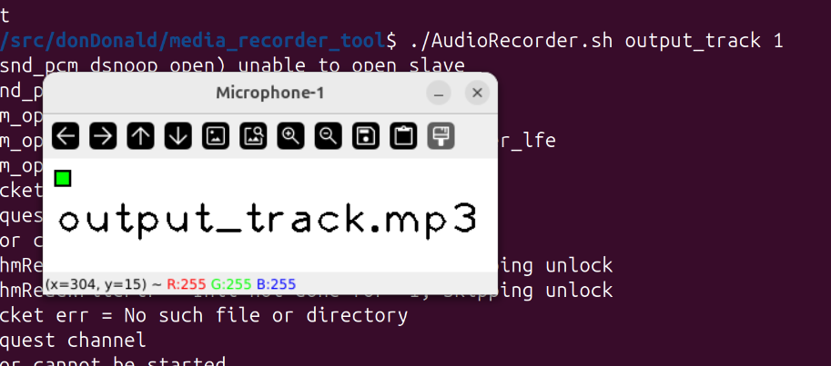
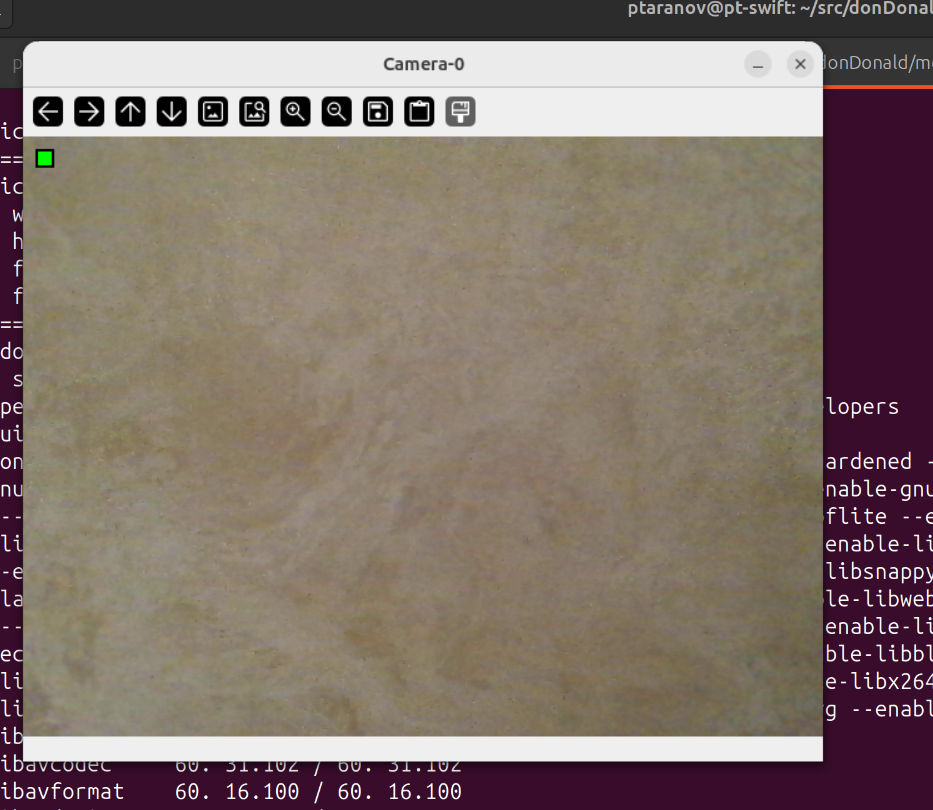
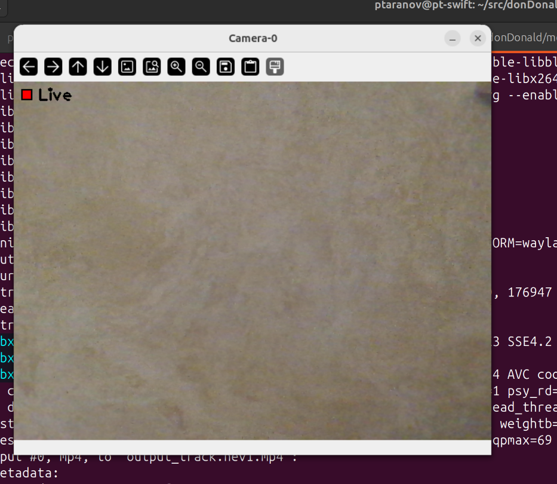
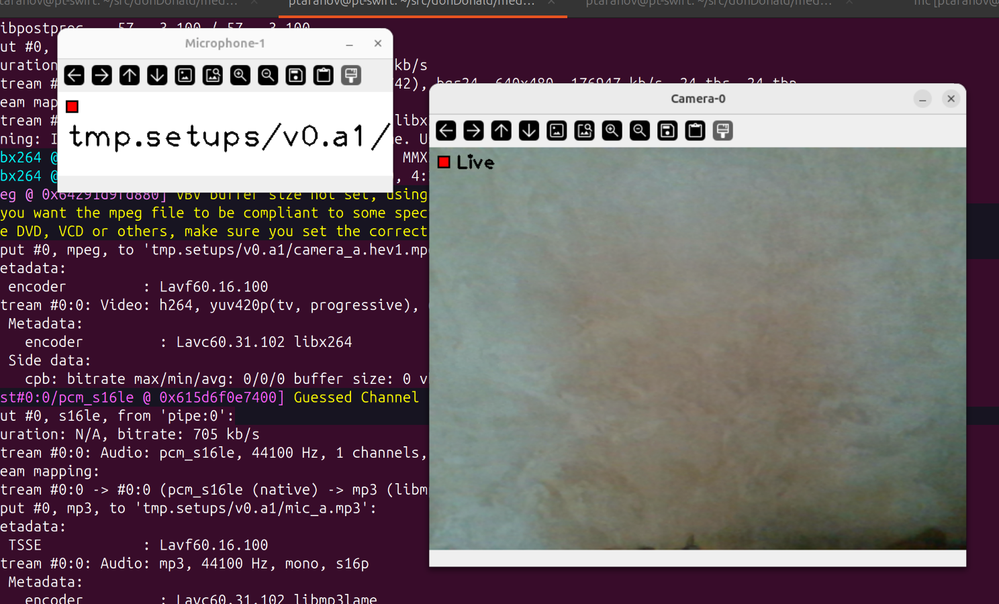

<div align="center">
    
</div>

# Intro
Set of tools to capture media streams and pack those into container, mp4 or mkv.
* audio/microphone capture tool
* video/camera capture tool

Supported hosts OSes:
* Ubuntu 20.04
* Ubuntu 24.04


# Setup 
Assume that ***python*** and ***pip3*** are installed by now. \
Or install ***python*** manually:
```
sudo apt update
 && sudo apt install -y python3
 && python3-pip
 && python3-venv
```


## 1-st create local python environment
```
python3 -m venv .venv
 && source .venv/bin/activate
```
Starting now on, assume that any py code is run for that newly created python environment, i.e. ***source .venv/bin/activate*** as called.


## 2-nd install all mandatory python packages
```
pip install opencv-python
pip install opencv-contrib-python 
pip install pyaudio
pip install ffmpeg-python
```


# Tools


## AudioRecorder.py, AudioRecorder.sh
A tool for capturing microphone devices.

To list available devices:
```
./AudioRecorder.sh
...
Available microphone devices:
- device ID: 1, name:HD-Audio Generic: ALC256 Analog (hw:1,0)
- device ID: 3, name:pipewire
- device ID: 4, name:pulse
- device ID: 5, name:default
```

To start recorder on micropnone with ID `1` (HD-Audio Generic):
```
./AudioRecorder.sh output_track 1
```
If device is not assigned the recorder will use device 0.

<div align="center"></div>

Once recorder is running toggle ***Pause***/***Record*** by `R` button.\
To quit recorder - use `ESC` button.
<div align="center"></div>


## VideoRecorder.py, VideoRecorder.sh
A tool for capturing camera devices.

To list available devices:
```
$ ./VideoRecorder.sh 
...
Available camera devices:
- device ID:0, name:camera-0
```

To start recorder on camera with ID `0` (camera-0) and pack it into `mp4` container:
```
./VideoRecorder.sh output_track mp4 0
```
If device is not assigned the recorder will use device 0.

<div align="center"></div>

Once recorder is running toggle ***Pause***/***Record*** by `R` button.\
To quit recorder - use `ESC` button.
<div align="center"></div>


## Container.sh
A tool for capturig many diffeerent type of streams at once.\
Receives a file describing streams setup as input.\
Can `capture` streams and pack them into `mp4` or `mkv` container.\
Here is a folder `setups` which contains some basic stream setups.\
Every setup is collection of streams, for instance:
* TRACK_0_TYPE=video - type of a track audio or video
* TRACK_0_DEVICE=0 - device id to use for capturing use AudioRecorder.sh or VideoRecorder.sh to collect devices
* TRACK_0_NAME=camera_a - track name
* TRACK_0_COMMAND=record - recorder state(pause|record) the recordng will be started immidiatelly once recorder is started


To start capturing `v0.a1` setup:
```
./Container.sh setups/v0.a1 capture
...
...
...
Video saved as tmp.setups/v0.a1/camera_a.hev1.mpeg
Audio saved as tmp.setups/v0.a1/mic_a.mp3
```
<div align="center"></div>


To start capturing `v0.a1` setup:
```
./Container.sh setups/v0.a1 create mp4
...
...
..
Command succeeded
mp4 container saved as setups/v0.a1.mp4
```


# Another usefull tools

## mkvtoolnix-gui
Powerful MKV Editing & Merging Tool
```
sudo apt install mkvtoolnix-gui
```
